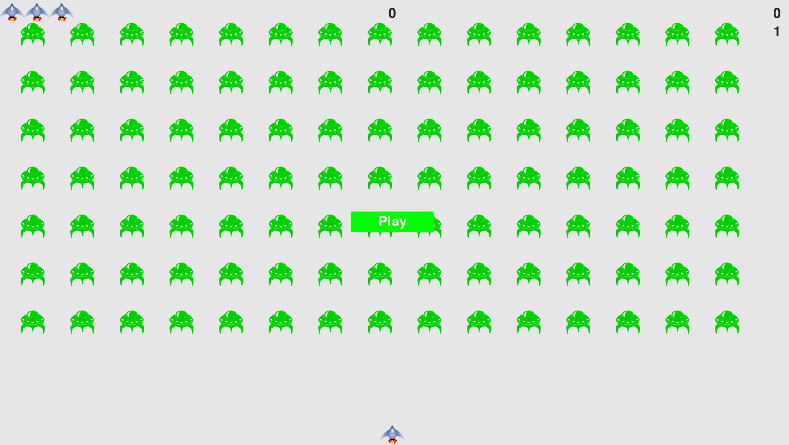
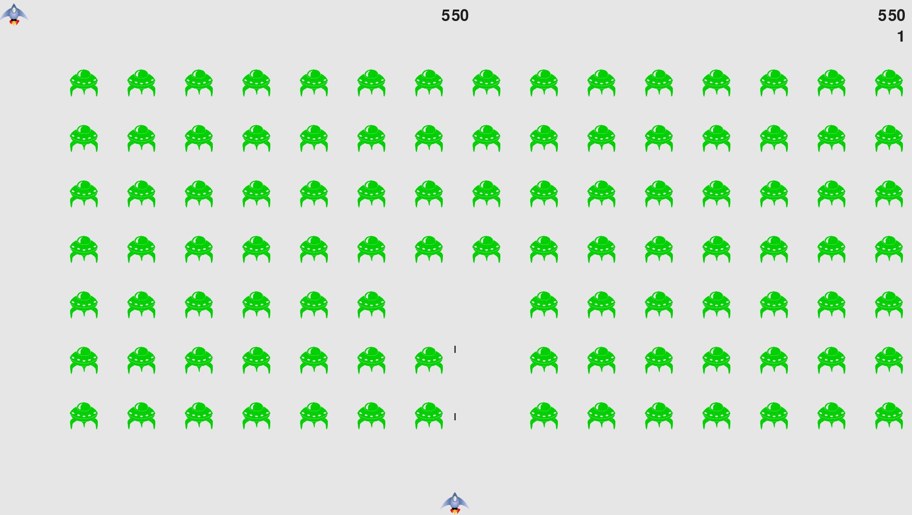

# Games

**Purpose of this Repository**

This repository is intended for my projects to develop Games to learn programming and have fun!

**Alien Invasion Game**

In Alien Invasion, the player controls a rocket ship that appears at the bottom center of the screen. The player can move the ship right and left using the arrow keys and shoot bullets using the spacebar. When the game begins, a fleet of aliens fills the sky and moves across and down the screen. The player shoots and destroys the aliens. If the player shoots all the aliens, a new fleet appears that moves faster than the previous fleet. If any alien hits the player's ship or reaches the bottom of the screen, the player loses a ship. If the player loses three ships, the game ends.

**Snake Game**

Snake is the common name for a video game concept where the player maneuvers a line which grows in length, with the line itself being a primary obstacle. The concept originated in the 1976 arcade game Blockade, and the ease of implementing Snake has led to hundreds of versions (some of which have the word snake or worm in the title) for many platforms. After a variant was preloaded on Nokia mobile phones in 1998, there was a resurgence of interest in the snake concept as it found a larger audience.

